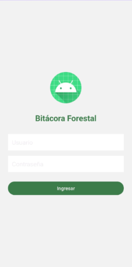

# Bitácora Forestal - Aplicación Android

## 📌 Descripción del proyecto
Esta aplicación móvil está diseñada para registrar información detallada de árboles muestreados en campo, siguiendo un formato estandarizado de bitácora. Permite almacenar datos clave como nombre científico y común, coordenadas, altura, diámetro, estado (hojas, flores y frutos), interacciones, observaciones generales y fotografías del árbol.

## ✨ Funcionalidades
- Registro de árboles con número identificador único.
- Campos personalizados para:
  - Nombre científico.
  - Coordenadas geográficas (WGS84, decimales o UTM zona 14).
  - Altura y diámetro del fuste en unidades métricas.
  - Porcentaje de hojas, flores y frutos.
  - Estado de hojas y madurez del fruto (activación automática según porcentaje).
  - Tipo de interacción interespecífica y organismo relacionado.
  - Observaciones generales.
- Carga de fotos desde cámara o galería.
- Almacenamiento local de los registros en archivos `.txt`.

## 👥 ¿Cómo usarlo?
1. Instala la aplicación en un dispositivo Android.
2. Abre la app y llena el formulario con los datos del árbol a registrar.
3. Adjunta una foto opcional desde la galería o toma una en el momento.
4. Presiona **Guardar** para almacenar el registro.
5. Repite el proceso para cada árbol observado.

## 📸 Capturas de pantalla

## ❓ ¿Dónde obtener ayuda?
Si necesitas asistencia para instalar, modificar o interpretar los datos de esta bitácora forestal, puedes contactarte con el autor.

## 📄 Licencia
Bitácora Forestal © 2025 por Allan Daniel Cruz Matias tiene licencia CC BY 4.0

## 👨‍💻 Autor del proyecto
- Desarrollado por: [Allan Daniel Cruz Matias]
- Con apoyo de herramientas generativas como ChatGPT (OpenAI) para estructura de código y diseño del formulario.
- Basado en el documento oficial de bitácora forestal de campo.

