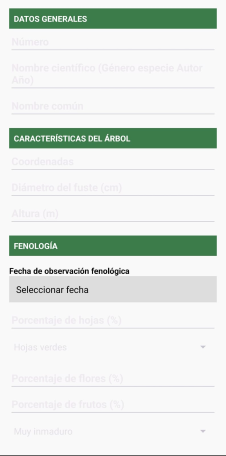

# Bitácora Forestal - Aplicación Android

## 📌 Descripción del proyecto
Bitácora Forestal es una aplicación móvil desarrollada para facilitar el registro estandarizado de árboles durante muestreos de campo. Permite capturar y almacenar información clave como nombre científico, coordenadas, altura, diámetro, fenología, interacciones ecológicas, observaciones y evidencia fotográfica, todo desde un dispositivo Android.

## ✨ Funcionalidades
Registro de árboles con identificador único.

Campos personalizados para:

✅ Nombre científico (formado por dos palabras, seguido del autor y año).

📍 Coordenadas geográficas (WGS84, decimales o UTM zona 14).

📏 Altura y diámetro del fuste (m).

🍃 Porcentaje de hojas, flores y frutos.

🟢 Estado de hojas y madurez del fruto (calculado automáticamente).

🔁 Tipo de interacción interespecífica y organismo implicado.

📝 Observaciones generales.

📷 Carga de fotos desde la cámara o galería.

💾 Almacenamiento local en archivos .txt y acceso visual a los registros guardados.

📅 Registro de fecha fenológica.

## 👥 ¿Cómo usarlo?
1. Instala la aplicación en un dispositivo Android.
2. Abre la app y llena el formulario con los datos del árbol a registrar.
3. Adjunta una foto opcional desde la galería o toma una en el momento.
4. Presiona **Guardar** para almacenar el registro.
5. Repite el proceso para cada árbol observado.

## 📸 Capturas de pantalla

## ❓ ¿Dónde obtener ayuda?
Si necesitas asistencia para instalar, modificar o interpretar los datos de esta bitácora forestal, puedes contactarte con el autor.

## 📄 Licencia
Bitácora Forestal © 2025 por Allan Daniel Cruz Matias tiene licencia CC BY 4.0

## 👨‍💻 Autor del proyecto
- Desarrollado por: [Allan Daniel Cruz Matias]
- Con apoyo de herramientas generativas como ChatGPT (OpenAI) para estructura de código y diseño del formulario.
- Basado en el documento oficial de bitácora forestal de campo.

